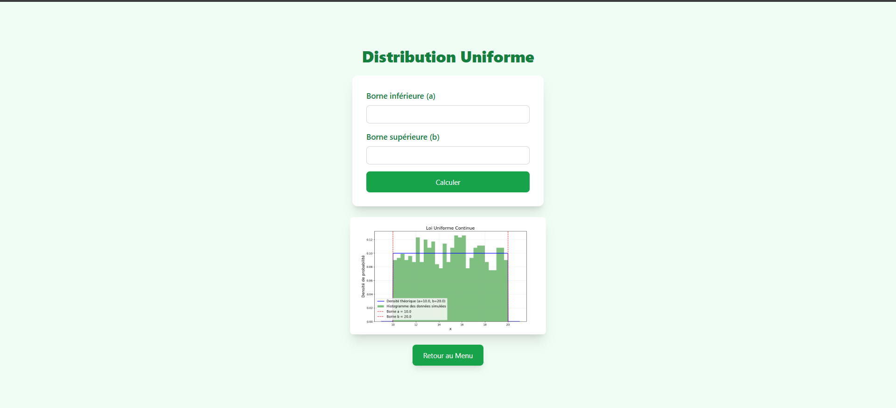

# Projet Django d'analyse de données Excel

## Description
Ce projet Django permet d'importer un fichier Excel CSV, d'analyser les données et de les visualiser sous forme de différents graphiques.

## Captures d'écran
Voici les captures d'écran du projet :

### Accueil

### Menu

### Sélection de graphique

### Sélection de Loi de probabilité

### Sélection du test d'hypothèse

## Fonctionnalités
- Importation d'un fichier Excel CSV
- Analyse des données
- Visualisation des données sous forme de :
  - Histogramme 
  - Diagramme en barres 
  - Diagramme en boîtes 
  - Diagramme circulaire 
  - Nuage de points 
  - Carte de chaleur 
  - Graphique à noyau de densité 
- Calcul des probabilités
  - Loi de Bernoulli 
  - Loi binomiale 
  - Loi uniforme 
  - Loi de Poisson 
  - Loi Normale 
  - Loi exponentielle 
-Tests des hypothèses
  - Z-test 
  - T-test 

## Installation
1. Clonez le dépôt Git :
git clone https://github.com/medaminerizki/dataAnalyse.git

Copy
2. Créez et activez un environnement virtuel :
python -m venv env
source env/bin/activate

Copy
3. Installez les dépendances :
pip install -r requirements.txt

Copy
4. Lancez le serveur de développement :
python manage.py runserver

Copy
5. Accédez à l'application dans votre navigateur à l'adresse `http://127.0.0.1:8000/`.

## Utilisation
1. Cliquez sur le bouton "Importer un fichier Excel" pour sélectionner le fichier CSV à analyser.
2. Une fois le fichier importé, les différents graphiques seront générés et affichés sur la page.
3. Vous pouvez interagir avec les graphiques pour explorer davantage les données.

## Auteurs
Mohamed Amine RIZKI  
Yahya SERNANE
